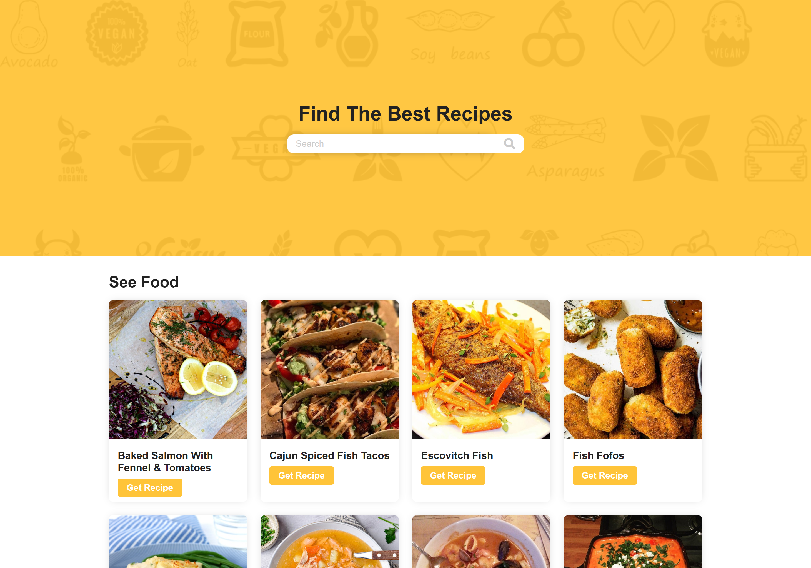

# GetRecipe 🍽️

**GetRecipe** is a sleek and beginner-friendly web app that fetches random recipes with images, ingredients, and step-by-step instructions using [TheMealDB API](https://www.themealdb.com/api.php). It’s designed for food lovers looking for quick inspiration in the kitchen.

🔗 **Live Demo:** [https://therecipe.netlify.app/](https://therecipe.netlify.app/)



---

## 🚀 Features

- 🥗 Fetch random meals instantly
- 🖼️ Displays recipe image, title, ingredients, and instructions
- 💡 User-friendly layout with responsive design
- ⚡ No page reload—built with Vanilla JavaScript
- 📱 Fully responsive on mobile and desktop

---

## 🛠️ Tech Stack

| Technology | Description               |
|------------|---------------------------|
| HTML5      | Page structure            |
| CSS3       | Styling & layout          |
| JavaScript | API requests & logic      |
| API        | [TheMealDB](https://www.themealdb.com/api.php)

---

## 📂 Project Structure

```
GetRecipe-main/
├── index.html
└── assets/
    ├── css/
    │   └── styles.css
    ├── js/
    │   └── app.js
    └── images/
        ├── meal.jpg
        └── bg-icons.png
```

---

## 🧪 How to Run Locally

1. **Clone this repository**
   ```bash
   git clone https://github.com/yourusername/GetRecipe.git
   ```

2. **Navigate to the folder**
   ```bash
   cd GetRecipe
   ```

3. **Open `index.html` in your browser**
   No server or installation needed—just open the HTML file.

---

## 📈 SEO & Performance Notes

- Fast-loading, single-page structure
- Optimized image assets
- Lightweight and efficient codebase
- Descriptive alt text and semantic HTML

---

## 🤝 Contribution

Pull requests are welcome! For major changes, please open an issue first to propose what you'd like to improve.

Steps to contribute:
- Fork the project
- Create your feature branch: `git checkout -b feature/your-feature`
- Commit your changes: `git commit -m "Add your feature"`
- Push to the branch: `git push origin feature/your-feature`
- Open a pull request

---

## 📄 License

This project is licensed under the [MIT License](https://choosealicense.com/licenses/mit/).

---

## 🙌 Acknowledgments

- API by [TheMealDB](https://www.themealdb.com)
- Design inspired by modern cooking apps
- Deployed on [Netlify](https://netlify.com)

---

> Created with ❤️ by [Abdelkarim Nakkahi] – [Live Demo](https://therecipe.netlify.app/)